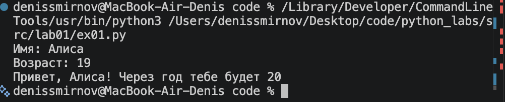
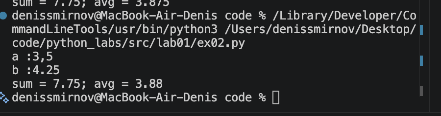
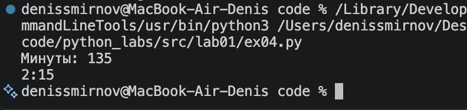
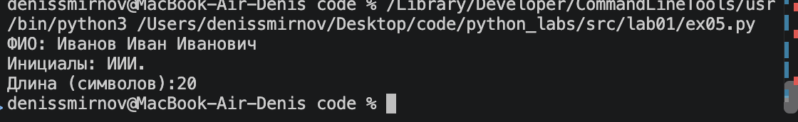
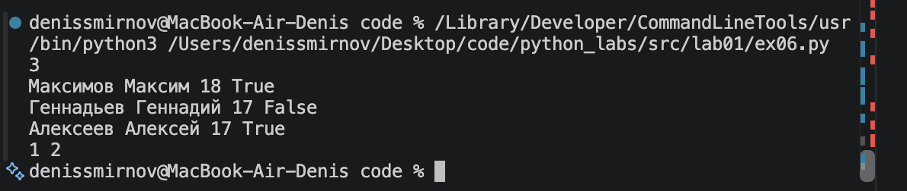
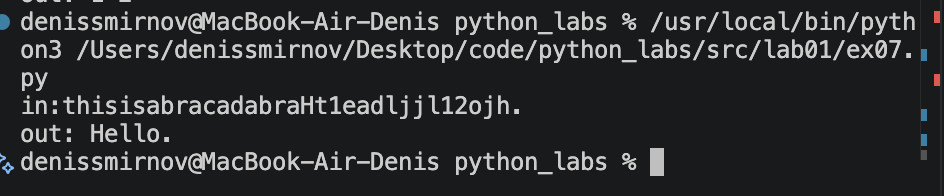

# python_labs
## ЛР 1
### ЗАДАНИЕ 1
В первом задании я реализовал счет данных с помощью команды input(), после присвоил эти данные переменным name и age. Далее с помощью f-строки и комманды print я вывел: Привет name! Через год тебе будет age+1

### ЗАДАНИЕ 2
Во втором задании я считал входные данные и с помощью replace сделал обработку чисел с точкой и запятой. Затем присвоил их переменным a и b. После этого вывел сумму и среднее арифметическое, округлив его до двух знаков.

### ЗАДАНИЕ 3
В этом номере я распаковал в три переменные генератор, который считывал входные данные. Затем по формулам из задания программа рассчитала base, vat_amount и total. С помощью print, f-строки, перевода строки и форматирования получил вывод по строкам с двумя знаками после запятой.

### ЗАДАНИЕ 4
Тут я сразу преобразовал входные данные в int, затем создал две переменные. Поделив минуты нацело на 60, получил количество часов и записал их в hours, а в mins записал остаток от деления минут на 60. В конце вывел эти переменные в формате, указанном в задании.

### ЗАДАНИЕ 5
В пятом номере я считал входные данные, а затем с помощью split убрал ненужные пробелы и получил список name из трёх элементов. В print я взял первую букву каждого элемента и с помощью join объединил их в строку без пробелов. Длину нашёл, сложив длины всех элементов и количество пробелов между ними.

### ЗАДАНИЕ 6
Здесь я сначала считал входные данные, преобразовав их в int, и присвоил переменной n. Затем с помощью цикла считал id всех участников и записал их в список name. После этого с помощью условных операторов определил количество людей с очного и заочного форматов обучения. В конце вывел всё с помощью print.

### ЗАДАНИЕ 7
В этом номере я нашел первый символ исходного текста, перебрав строку и выбрав заглавные буквы. Затем взял первый элемент списка и нашел его индекс в исходной строке. После этого нашел индекс первой точки. В print прошел срезом по строке с шагом 3, начиная с первого символа и заканчивая точкой.

