ЛР2 - Коллекции и матрицы
## Задание 1
### Функция min_max
```python
def max_min(nums: list[float | int]) -> tuple[float | int, float | int]:
    if len(nums) == 0:
        raise ValueError
    return min(nums), max(nums)

print(max_min(eval(input())))
```
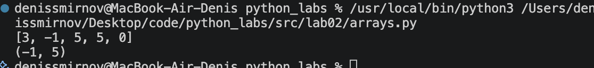
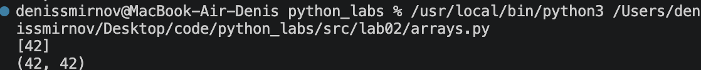
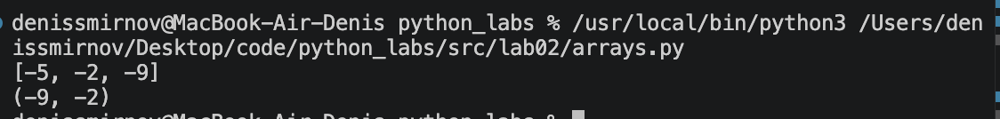
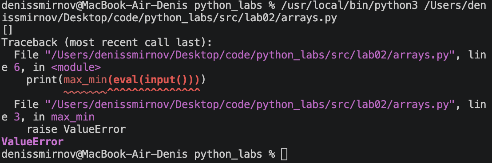
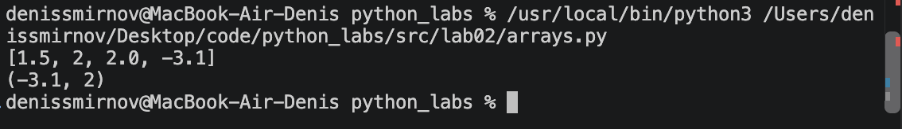

### Функция unique_sorted
```python
def unique_sorted(nums: list[float | int]) -> list[float | int]:
    return sorted(set(nums))

print(unique_sorted(eval(input())))
```
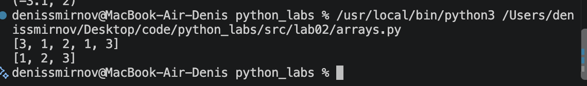
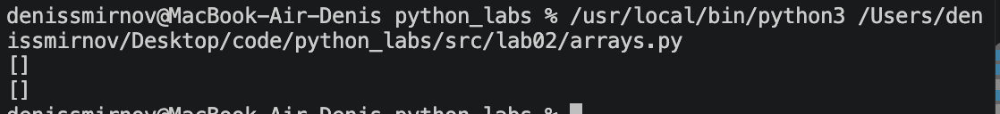
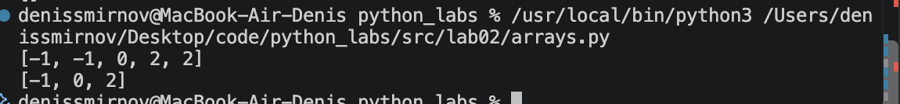
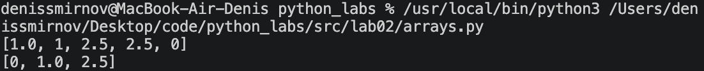

### Функция flatten
```python
def flatten(mat: list[list | tuple]) -> list:
    res = []
    for i in mat:
        if type(i) is not list and type(i) is not tuple:
            raise TypeError("строка не строка матрицы")
        res.extend(i)
    return res

print(flatten(eval(input())))
```
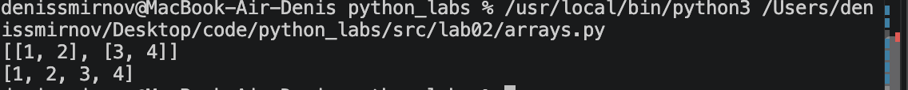
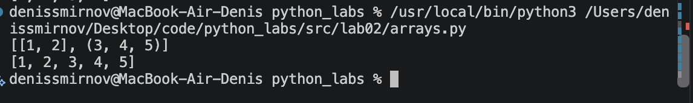
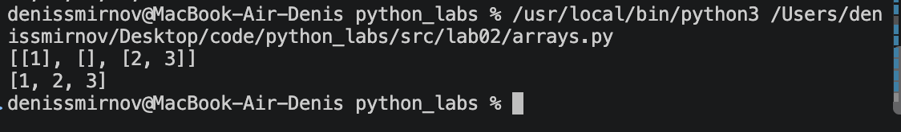
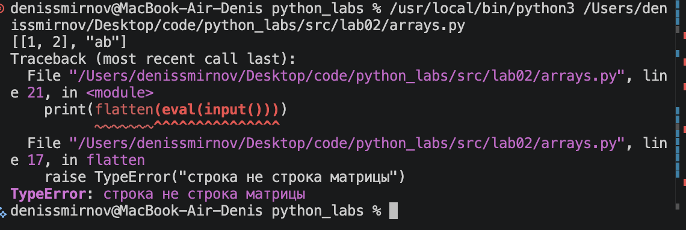

## Задание B
### Функция transpose
```python
def transpose(mat: list[list[float | int]]) -> list[list]:
    if len(mat) == 0 : return []
    if len(mat) == 1: return [list(i) for i in zip(*mat)]
    if len(mat) > 1:
        for i in mat:
            if len(i) != len(mat[0]):
                raise ValueError("рваная матрица")
    return [list(i) for i in zip(*mat)]

print(transpose(eval(input())))
```
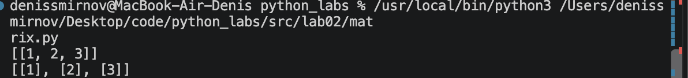
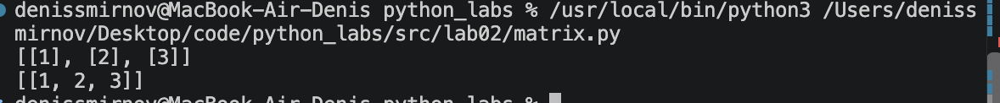
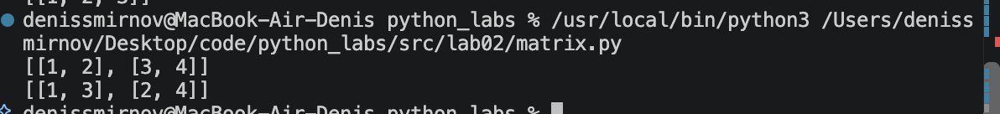
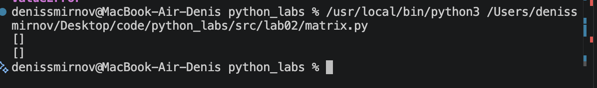
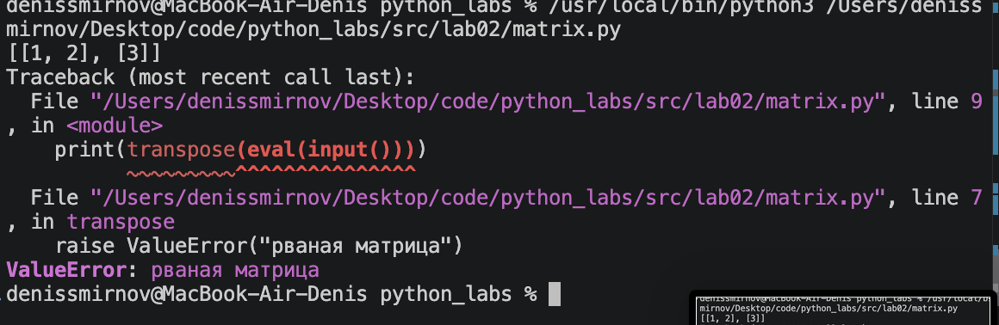

### Функция row_sums
```python
def row_sums(mat: list[list[float | int]]) -> list[float]:
    if len(mat) == 0: raise ValueError
    if len(mat) > 0:
        for i in mat:
            if len(i) != len(mat[0]):
                raise ValueError("рваная матрица")
    return [sum(i) for i in mat]

print(row_sums(eval(input())))
```
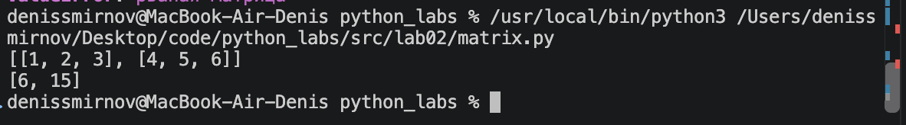
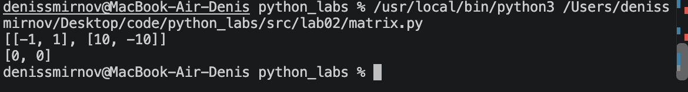
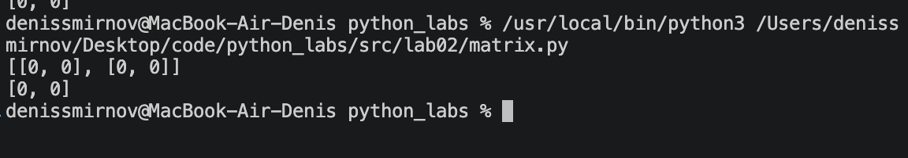
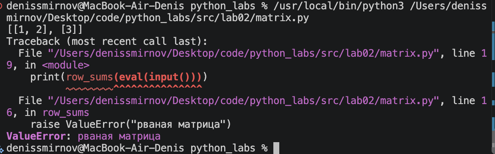

### Функция col_sums
```python
def col_sums(mat: list[list[float | int]]) -> list[float]:
    if len(mat) == 0: raise ValueError
    if len(mat) > 0:
        for i in mat:
            if len(i) != len(mat[0]):
                raise ValueError("рваная матрица")
    return [sum(i) for i in zip(*mat)]
```
print(col_sums(eval(input())))
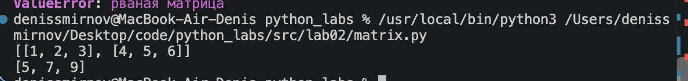
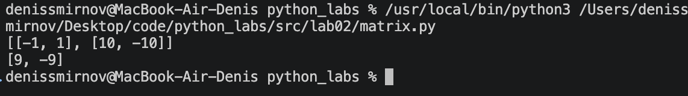
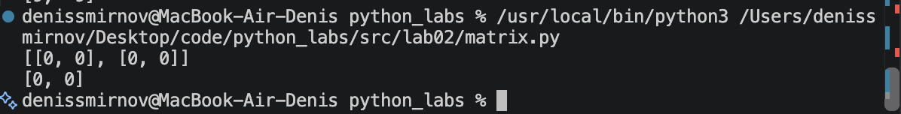
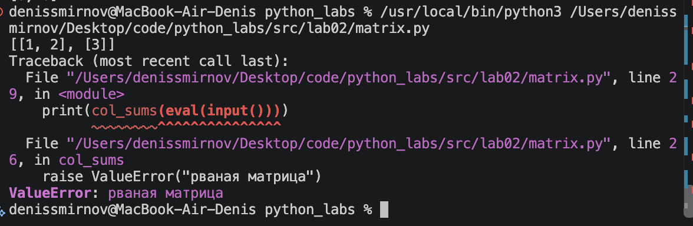

## Задание C

### Функция format_record
```python
def format_record(rec: tuple[str, str, float]) -> str:
    if len(rec)!= 3 :
        raise ValueError ("некорректный ввод")

    if not rec[0].strip():
        raise ValueError("ФИО не может быть пустым")

    if not rec[1].strip():
        raise ValueError("Группа не может быть пустой")

    if not isinstance(rec[2], (int, float)):
        raise TypeError("GPA должен быть числом")

    fio = rec[0].split()

    if len(fio) == 3:
        name = fio[0].capitalize() + " " + fio[1][0].upper() + "." + fio[2][0].upper() + "."
    elif len(fio) == 2:
        name = fio[0].capitalize() + " " + fio[1][0].upper() + "."
    else:
        raise ValueError("Некорректное ФИО")

    return f"{name}, гр. {rec[1]}, GPA {rec[2]:.2f}"

rec = eval(input())
print(format_record(rec))
```
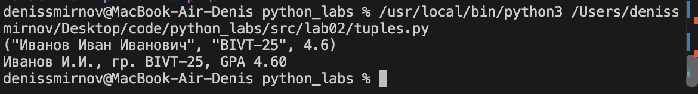
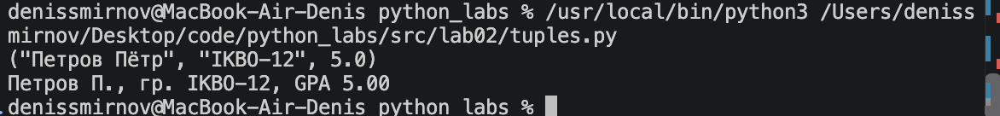
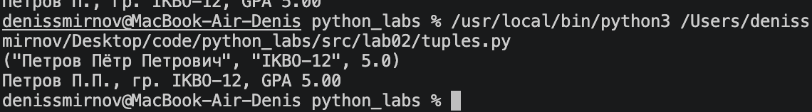
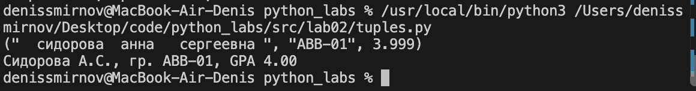
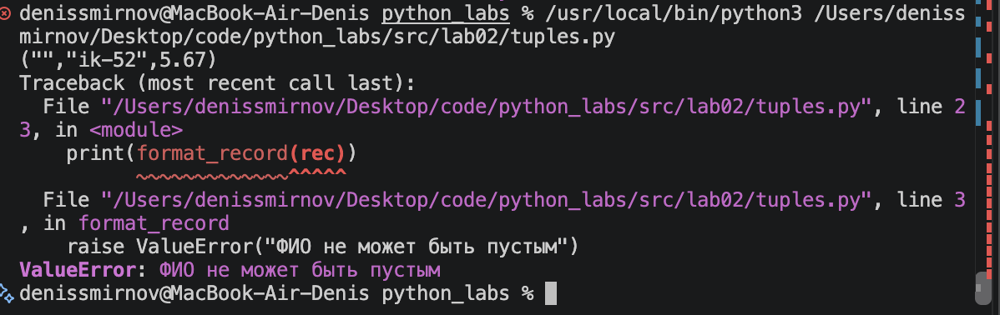
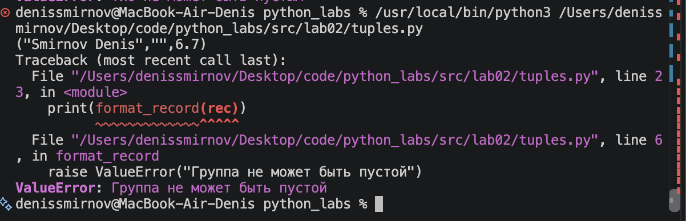
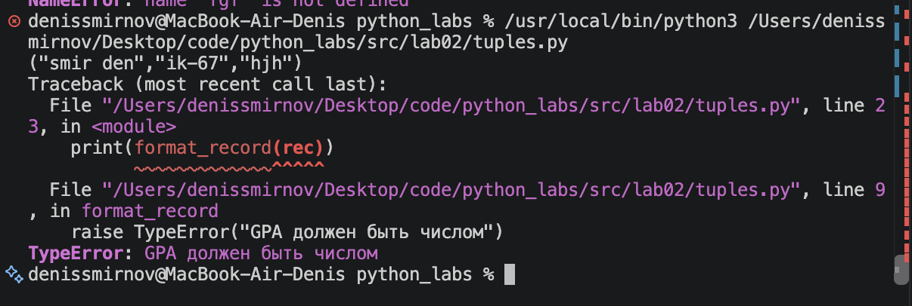
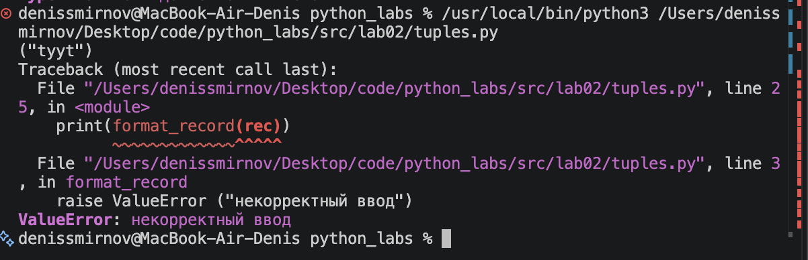